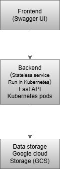
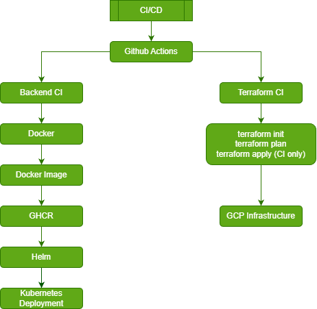

# Architecture Overview

## Application Architecture

The application follows a classic cloud-native architecture:
Frontend → Backend → Cloud Storage.

- Frontend: Swagger UI
- Backend: Stateless FastAPI service running in Kubernetes Pods
- Data Storage: Google Cloud Storage (GCS)
- The backend service is built with FastAPI and follows a modular Python application structure (backend/app)
- Object storage folders are implemented as logical prefixes in GCS
The application is designed to be stateless, which allows Kubernetes to scale pods horizontally
and perform rolling updates without data loss.

## CI/CD Pipeline

The project uses two independent CI/CD pipelines, implemented with GitHub Actions,
each responsible for a different part of the system.

## Backend CI Pipeline
The Backend CI pipeline is responsible for application delivery and includes:

- Python code linting (flake8)
- Dockerfile linting (Hadolint)
- Docker image build
- Container vulnerability scanning (Trivy, non-blocking)
- Push of the Docker image to GitHub Container Registry (GHCR)
- Deployment to Kubernetes using Helm

The backend pipeline:
- runs automatically on push to the main branch
- is triggered only when backend-related files change
- supports manual execution via workflow_dispatch

## Terraform CI Pipeline (Infrastructure)

Infrastructure is managed using Terraform with a dedicated CI pipeline.
The Terraform CI pipeline performs:
- terraform init
- terraform fmt
- terraform validate
- terraform plan

terraform apply is executed only via **GitHub Actions**
and only after merge to the main branch.

Local usage of Terraform is limited to terraform **init** and **terraform** plan.
Local terraform apply is intentionally disabled by process to prevent uncontrolled changes.

Terraform state is stored remotely in Google Cloud Storage.

Authentication to Google Cloud from CI/CD pipelines is performed using Workload Identity,
without using static JSON service account keys.

## Infrastructure Architecture

- Google Kubernetes Engine (GKE) is used as the Kubernetes platform
- Node pools are explicitly managed via Terraform
- Workload Identity is enabled to securely connect Kubernetes workloads with Google Cloud services
- IAM permissions are managed declaratively via Terraform
- Infrastructure changes are fully auditable through CI/CD pipelines

## Monitoring and Observability

The monitoring stack includes:
- Prometheus for Kubernetes and application metrics collection
- Grafana for visualization and dashboards
- Kubernetes liveness and readiness probes
- Application-level health endpoint (/health)
- Monitoring allows early detection of issues and provides visibility into application
and infrastructure performance.

## Architecture Summary

- The project follows a production-oriented cloud-native architecture
- Application delivery and infrastructure management are clearly separated
- All infrastructure changes are controlled via Terraform CI
- Application deployments are automated via Backend CI
- Security is enforced using Workload Identity and least-privilege access

This architecture ensures scalability, security, and controlled change management,
while remaining simple enough for a training DevOps project.